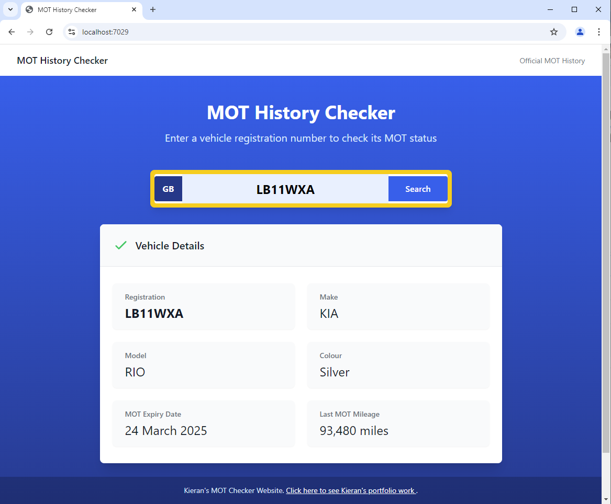

# MOT History Checker

A web application built with Blazor WebAssembly and ASP.NET Core API to check vehicle MOT history using the DVSA API.



## Features

- Check MOT status by vehicle registration
- Display vehicle details including:
  - Make and model
  - Colour
  - MOT expiry date
  - Last recorded mileage
- Real-time validation
- Responsive design
- Loading states
- Error handling

## Tech Stack

- Frontend:
  - Blazor WebAssembly
  - Tailwind CSS
  - bUnit for testing
- Backend:
  - ASP.NET Core API
  - DVSA MOT History API integration
  - xUnit for testing
  - Moq for mocking

## Prerequisites

- .NET 8.0 SDK
- DVSA API credentials
  - Client ID
  - Client Secret
  - API Key

## Project Structure

```
MotChecker/
├── MotChecker/              # Blazor WebAssembly Client
│   ├── Components/         
│   ├── Models/             
│   ├── Pages/              
│   └── Services/           
├── MotChecker.Api/          # Backend API
│   ├── Controllers/        
│   ├── Models/             
│   └── Services/           
├── MotChecker.Tests/        # Client Tests
└── MotChecker.Api.Tests/    # API Tests
```

## Testing

Run the tests using:
```bash
dotnet test
```

The project includes:
- Unit tests for frontend components
- API integration tests
- Service layer tests
- Validation tests

## Running in Development

1. Set both projects as startup projects in Visual Studio
2. Press F5 to run both projects
3. Access the application at `https://localhost:7029`

## API Documentation

The API documentation is available via Swagger at:
```
https://localhost:7276/swagger
```

## Contributing

1. Fork the repository
2. Create your feature branch (`git checkout -b feature/AmazingFeature`)
3. Commit your changes (`git commit -m 'Add some AmazingFeature'`)
4. Push to the branch (`git push origin feature/AmazingFeature`)
5. Open a Pull Request

## License

This project is licensed under the MIT License - see the LICENSE file for details

## Acknowledgments

- [DVSA MOT History API](https://dvsa.github.io/mot-history-api-documentation/)
- [Blazor WebAssembly](https://docs.microsoft.com/aspnet/core/blazor/)
- [Tailwind CSS](https://tailwindcss.com/)
